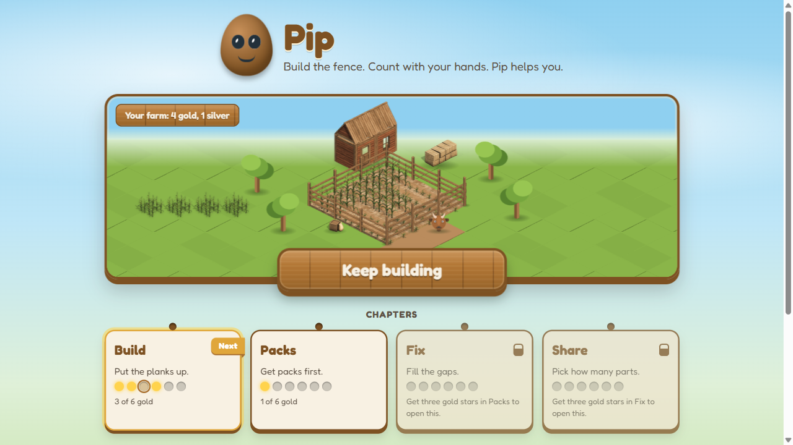
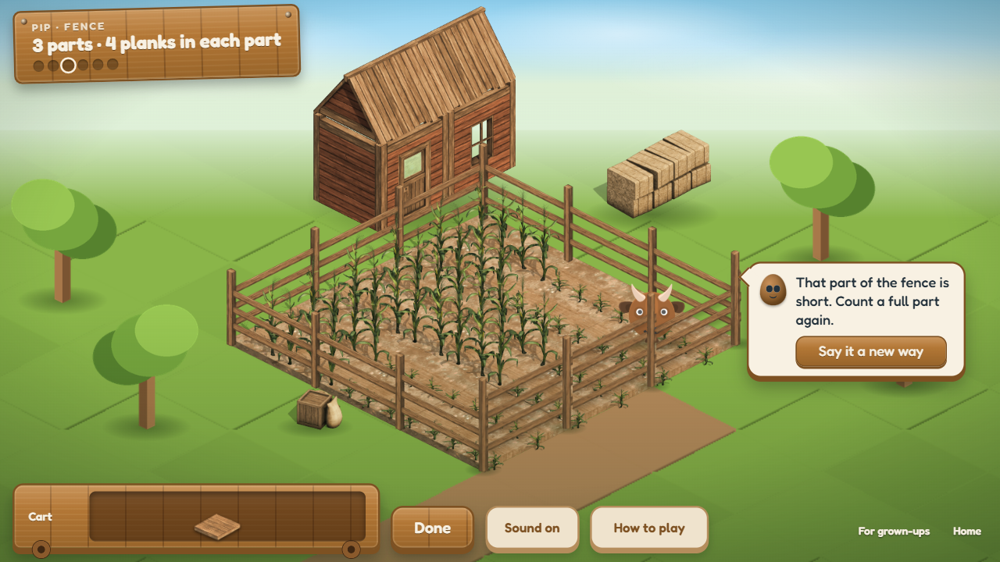
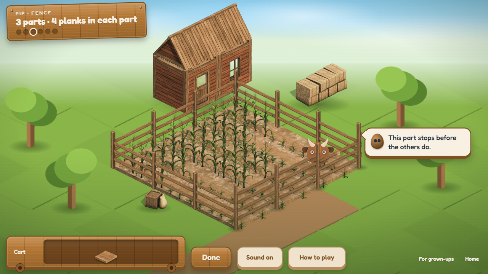
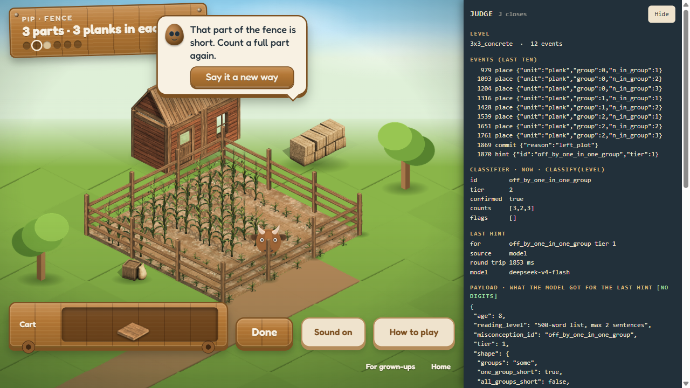
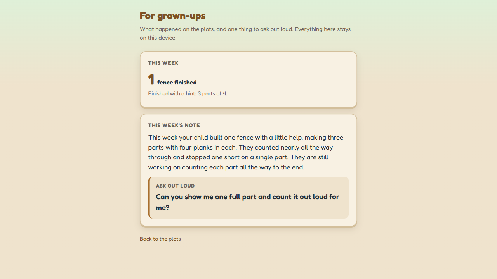

# Pip

A maths game for children aged 6 to 10, built around one idea: **the fence is the sum.**

A child is told "3 parts, 4 planks in each part" and given a cart of planks. She builds. If she
counts wrong, the fence stands wrong. A part is short, or a plank sticks out over the post. Nothing
turns red. The goat walks through the gap and into the corn, and Pip, a little seed with eyes and a
child's voice, helps her find the gap and fix it with her own hands.

Built for the Nerdy AI Hackathon Challenge, September 2026.



## Try it

**Live: https://pip-4div.onrender.com** (free plan, so the first visit can take half a minute to wake up).

Or run it yourself:

```bash
git clone https://github.com/manpreet171/pip-fence.git && cd pip-fence && node src/server.mjs
```

Open http://localhost:5177. Nothing to install, just Node 22. Add `DEEPSEEK_API_KEY` or
`ANTHROPIC_API_KEY` if you want the live model, and `AZURE_SPEECH_KEY` with `AZURE_SPEECH_REGION`
if you want Pip's own voice for the lines the model writes; without keys Pip uses her written lines
and your browser's voice, and the game plays the same. Turn the sound on. Press **J** during play to see what the AI is doing.

Your own copy online, one click:
[](https://render.com/deploy?repo=https://github.com/manpreet171/pip-fence)

How it all works, in one page: [docs/DESIGN.md](docs/DESIGN.md). For engineers:
[docs/ARCHITECTURE.md](docs/ARCHITECTURE.md) (diagrams, trust boundaries, failure modes) and
[docs/PRD.md](docs/PRD.md) (goals, non-goals, metrics, risks).

## Why "Pip"

Two reasons, and one accident.

A pip is a seed. It is also the little counting marks that pop up on the rails when the child taps
a part to count it: one, two, three, four. So the helper who counts with her is called Pip. It is
one syllable, and a six-year-old can say it.

The accident: for two days there was a second game in this project, an old Indian sowing game
played with seeds in pits. It did not survive. A child could not learn its rules from the screen,
so it was dropped the day before the deadline. The only thing that made it out of that game alive
was the seed. It is now the mascot of a game about fences. We think it is happy there.

## Where it came from

The brief asked for a game that makes early arithmetic feel natural and rewards getting good at it,
with AI at the heart of it. The easy version of that is a quiz with a cartoon around it and a chatbot
that explains. We built that first. Then we threw it away, and this is why.

The first three days went to reading, before any game code. Two findings changed everything
([docs/RESEARCH-LEARNER.md](docs/RESEARCH-LEARNER.md)):

- Children of this age learn more, at the same time on task, when the maths *is* the game
  rather than a quiz wrapped in a game. That is the one result in the whole pile that shows a
  learning gain and not just "kids liked it" (Habgood and Ainsworth, *Zombie Division*).
- In a large randomised trial, ten minutes of AI help made children *worse* at working on
  their own once the AI was taken away.

So the rules became: the build is the maths, and the AI must never give the answer.

Getting here was not a straight line. Four ideas were tried and put down before this one, each
by a small experiment rather than by argument: a misconception engine built from real data, a
sixty-second spoken defence, a tutor that is deliberately wrong, and a question-quality coach that
turned out to already exist as Khanmigo. Then the first build was stopped on day two because, honestly,
it was a quiz with a farm behind it. Decision D-043 in the log is the moment we admitted that and
started again from the research. The fence came out of that restart.

Every one of those turns, eighty-three decisions in all, is in
[docs/DECISIONS.md](docs/DECISIONS.md) with what we rejected and why. Rung was the working name
until 17 September, the day before the deadline. We kept the dates and the mistakes in because they are the real story.

## What makes it different

- **The wrong answer stays on the screen as a wrong fence.** No red cross, no score, no confetti.
  She looks at what she built, sees the gap, and fixes it.
- **Mistakes are named, not scored.** Code reads every tap and works out *which* mistake the fence
  shows: a part short, parts and planks swapped, a plank over the post, a pack treated as a plank,
  the gaps miscounted, the shares uneven. Fifteen of them. When two mistakes make the same fence,
  Pip asks her to tap a part she thinks is finished, and the parts glow until she does. Her tap
  decides. If she does not tap, Pip gives the likelier hint after twenty seconds.
- **Four chapters on one board.** Build, Packs, Fix and Share. Same fence, and it quietly becomes
  multiplication, units inside units, subtraction and addition, and division. A chapter opens when
  she has three gold stars in the one before, and she moves on to it once every fence in hers is gold.
  The last fence of all ends with a star and Pip's last line.
- **Pip counts with her.** Every plank she places, Pip says the number that part now has, in her
  own voice. The cart pulses when her hand is empty, the parts glow when it is full, and on her first move an
  arrow sits on the next thing to tap, so there is never a question of what to tap next.
- **Every word is one a six-year-old can read**, checked against an early-reader word list (Dolch and Fry sight words plus the game's own nouns).
  Pip's lines are spoken in a child's voice, not a robot's.



## How we used the AI, and why this way

The model never sees a number from the fence and never grades. Code owns the truth. The model does
the parts that need a feel for words and for practice, and code checks every single thing it says
before the child hears it.

| What Pip does | The model's part | Code's part |
|---|---|---|
| Hint | Puts a written hint into fresh words for a child of six | No digits, no number words, only simple words. A second call, at temperature zero, checks the meaning is the same. If anything fails, the written line is used |
| Cheer | Says what she did right when a fence is done | Gets only yes/no facts. A judge rejects anything not in the facts. If there is nothing specific to praise, no call is made |
| Plan | Picks her next fence from her last eight, and says why | Code lists the fences in her chapter that practise her mistake. The pick has to be on that list, and the reason line is checked like a hint |
| Show | Writes a worked example as moves: point, count, place, take back, say | Code runs the moves in a simulator first. Illegal or useless scripts are replaced by code's own. Pip fixes one part and hands the rest back |
| Parent note | Writes a short weekly note and one question to ask out loud | Gets a checked summary. Blame words, claims about progress or readiness, internal labels, and any fence count that is not the real one are rejected |



**Why there is no chat box.** Because of that trial. An AI that answers makes learning worse the
moment it leaves the room. Pip cannot give the answer because Pip is never told the number. The
child never types or speaks, so nothing personal ever leaves the device.

**Why code names the mistake, not the model.** A model reading the fence would be right more often
on strange builds and wrong in ways nobody could check. The classifier is a small pure function,
tested on 169 hand-written sequences, and it is right whenever it commits.



## What we measured

```bash
python evals/run_all.py
```

| Check | What it proves |
|---|---|
| `readinglevel.py --assert` | All 48 hint lines: two sentences at most, no digits or number words, words from the early-reader list |
| `classifier_eval.mjs` | 169 hand-written builds. Right whenever it commits, silent when two mistakes look the same |
| `buddy_test.mjs` | 86 checks: no number crosses the wire, the gate rejects what it must, every failure falls back to a written line |

With a live model, measured and written up in `docs/results/`:

| Run | Result |
|---|---|
| [Latency and cost](docs/results/LATENCY-RESULTS.md) | 20 live hints: under a second, about a hundredth of a cent each |
| [The judge](docs/results/JUDGE-RESULTS.md) | 20 rephrases: 12 shipped, 6 stopped by the gate, 2 caught by the judge |
| [Red team](docs/results/REDTEAM-RESULTS.md) | An attacker shown everything the model sees guesses the answer no better than always saying the commonest one |
| [The planner](docs/results/PLAN-RESULTS.md) | 8 learner records: every pick inside code's list, six of eight different from the fixed order, for sensible reasons |
| [Worked examples](docs/results/SHOW-RESULTS.md) | 6 fence states: 5 scripts passed the simulator and ran, 1 replaced by code's own |



## What worries us

We would rather say this here than have you find it.

- **No child has played it yet.** Everything above about "it teaches" is architecture and
  measurement, not a child. That is the biggest gap, and we know it.
- **The classifier agrees with its own spec**, not with real children. It will meet mistakes
  nobody wrote a test for.
- **Pip's voice needs a key.** On the live site every line, fixed or freshly written by the
  model, is the same child's voice, because the server holds a speech key. Run it yourself without
  one and the model's fresh lines fall back to your browser's voice, and it shows.
- **It is not deep.** Twenty-four levels of one mechanic. Enough to show the idea. Thin as a
  product.
- **The word gate is only a word gate.** It stops digits and number words. It cannot stop a
  sentence that points the wrong way. That is what the judge is for, and the judge is another
  model.

## Layout

```
src/server.mjs        the server, no dependencies; the model endpoints are the trust boundary
src/public/           the game (build.html, fence.mjs), home, parent page, judge overlay, Pip's pieces, art
src/engine/buddy.mjs  every model job: what it is given, the gate, the judge, the fallbacks
data/                 the hint lines and the word list
evals/                the checks above
scripts/              sprite cut-outs and Pip's voice clips
docs/                 how it works, the research, every decision, the measurements, screenshots
```

Art is Kenney's CC0 isometric packs. Font is Fredoka, OFL. Pip's voice clips are generated once with
`scripts/voice_clips.mjs` from the same voice the server uses live, and included as audio files.
Credits in [docs/CREDITS.md](docs/CREDITS.md).
