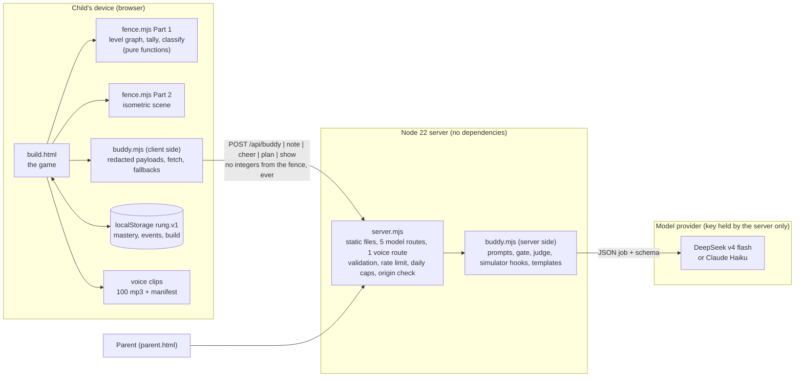
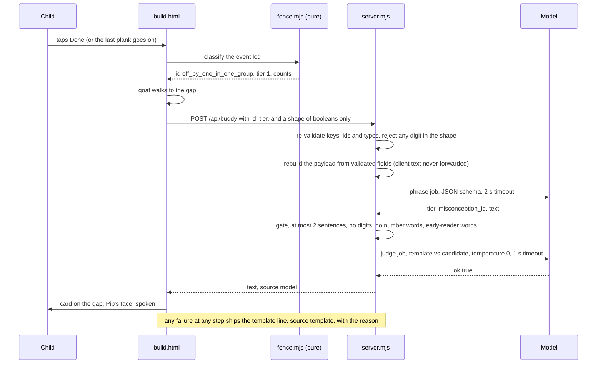

# Architecture

How Pip is put together, what crosses each boundary, what fails and how, and what would break
first at scale. Product behaviour is in [DESIGN.md](DESIGN.md); the reasons are in
[DECISIONS.md](DECISIONS.md). Everything here is as built.

## 1. The system on one page



The same `buddy.mjs` module runs in both places. The browser uses its payload builders and
fallbacks; the server uses its prompts, gate and judge. One file, one contract.

**Where truth lives.** The classifier and the level graph (`fence.mjs` Part 1) are pure functions
over the event log. They have no I/O, no clock, no model, and are imported unchanged by the eval
harness under Node. Everything the child sees as a verdict comes from there.

## 2. The path that matters: a wrong fence becomes a spoken hint



Three things to notice. The classifier ran before any network call, so the verdict never depends
on the model. The server never trusts the client's text; it rebuilds the payload. And there is no
path on which the child sees nothing: every branch ends in a line.

## 3. Trust boundaries and what crosses them

| Boundary | What crosses | Control |
|---|---|---|
| Child → browser code | Taps only. No typing, no microphone, no camera | Nothing personal exists to leak |
| Browser → server | Five JSON bodies, 4 KB cap (8 KB for plan) | Every key, id and type re-validated; unknown keys rejected; digits rejected where booleans are expected |
| Server → model | Prompts with **no integer derived from the fence**: booleans, plain-words meanings, fence names | Redaction is measured by a red-team attack, not asserted ([results/REDTEAM-RESULTS.md](results/REDTEAM-RESULTS.md)) |
| Model → server | One JSON object per job | Schema check; lexical gate; semantic judge (hint, cheer, plan) or simulator (show); template fallback |
| Browser → voice | `POST /api/say` with one line of text | Only a line the server itself produced or ships is voiced; 300 characters at most; cached by text; a daily character cap; 404 with no key, and the browser voice takes over. Provider by key: Azure (Ana, the clips' voice, what the live site runs), OpenAI or ElevenLabs |
| Server → browser | `{text, source, reason?}` or a validated pick / script | The browser re-checks the plan's pick against its own candidate list and re-simulates the show script before performing it |
| Internet → server | Any POST | Per-address limit 60/min (real address behind the proxy); daily cap on model calls, 1,500 by default; cross-origin POSTs refused; the key lives only in the server's environment and is never logged |

The `show` job is the one place the model is given real counts, because it must write moves on the
actual fence. That is why its output is a script in a five-word vocabulary and not prose, and why
the simulator, not a judge, is the check: a script that over-fills a part, breaks a full one, or
fixes nothing is replaced by code's own script. The only free text in it, the `say` lines, goes
through the gate with numbers banned.

## 4. Data

There is no database. The state is one key in the browser's local storage:

```
rung.v1 = { v: 1, mastery: { "<node>": 0.5 | 1 }, build: { node, parts[], cart, n }, events: [...], ended }
```

**The event log** is the source of truth for everything the classifier decides. Each event has a
time in ms from level start and a name:

| Event | Fields | Meaning |
|---|---|---|
| `level_start` | node, at | a level begins |
| `plank_held` | held | the cart was tapped |
| `place` / `remove` | unit, group, n_in_group | a plank or pack on or off a part |
| `order` | planks or packs | the note was delivered (Packs, Fix) |
| `parts` | n | the frame was locked (Share) |
| `tap_count` | group | an empty-hand tap on a part: she is counting |
| `tap_idle`, `place_failed` | nearest_group | taps that did nothing, kept for the record |
| `commit` | reason: left_plot, idle or probe_timeout | Done, the last plank, 45 s of silence, or 20 s with no tap on a probe |
| `hint` | id, tier | a hint was shown; tier rises per repeat of the same id |
| `show` | source, moves | a worked example ran |

The log is capped at the last 500 events. The parent page and the planner read it; the child never
sees it. Nothing leaves the device except the redacted payloads above.

**The level graph** is 24 nodes: six shapes (2x3, 3x3, 3x4, 4x3, 4x5, 2x5) in four modes (build,
packs, fix, share). A chapter unlocks when the previous one holds three gold stars. Mastery 1 is a
fence finished with no hint, 0.5 with one. `next()` is code's fixed order; the planner may choose
any unmastered node that exercises the last mistake, and nothing else.

## 5. Failure modes

| What fails | What the child sees | How we know |
|---|---|---|
| No API key on the server | The template line for every job, spoken in Pip's voice. The game is complete without a key | `source: "template", reason: "no_key"` |
| Model slow or down | Hint 2 s, judge 1 s, cheer 2 s, plan 2.5 s, show 4 s server-side; the browser gives up a little later. Template ships | reason `timeout`, `http_5xx`, `error` |
| Model returns bad JSON or wrong keys | Template | reason `parse`, `schema` |
| Model writes a digit, a number word, an affect word, hard words, three sentences | Template | reason `number`, `affect`, `vocab`, `sentences` |
| Judge says no, or cannot answer | Template (fail closed) | reason `judge`, `judge_unavailable` |
| Planner picks a fence not on code's list | Code's own next fence; the model's line is dropped | reason `choice` |
| Show script is illegal or fixes nothing | Code's own script for the first wrong part | reason `simulation` |
| Daily cap reached | Templates until midnight UTC | the server stops calling the model |
| No speech key, or the voice cap reached | Fixed lines still play from the clips; fresh model lines are read by the browser's own voice | `/api/say` answers 404 |
| Storage blocked (private window, cleared) | The game runs; progress does not persist | every read and write is wrapped |
| Two mistakes make the same fence | A probe: "Tap a part you think is finished." The parts glow; her tap decides. After 20 s with no tap, the likelier hint, marked unconfirmed | id `ambiguous`, 25 of 162 fixtures; commit reason `probe_timeout` |
| No taps for 45 s on a wrong fence | The level commits itself and the hint appears | reason `idle` |

Press **J** in the game and every row above is visible as it happens: the last hint's source and
reason, the payload as sent, who chose the next fence, who wrote the moves.

## 6. Non-functional requirements, as measured

| Requirement | Target | Measured |
|---|---|---|
| Hint latency | Under a second at p50 | p50 757 ms, p95 1.4 s on 20 live hints ([results/LATENCY-RESULTS.md](results/LATENCY-RESULTS.md)) |
| Cost | Cents per child-hour, not dollars | About $0.00015 per hint |
| Answer leakage | No better than guessing | +0.0% lift over the majority-class baseline, forced choice ([results/REDTEAM-RESULTS.md](results/REDTEAM-RESULTS.md)) |
| Reading level | Every line a six-year-old can read | 48 templates through the gate; UI strings swept against the same list |
| Privacy | Nothing personal leaves the device | No typing, no audio in, no accounts, one local key |
| Dependencies | None at run time | `package.json` has no dependencies; Node 22 standard library only |
| Devices | Phone to desktop | Layout verified at 390 px and 1280 px; reduced-motion honoured |
| Degradation | Full game with no network | Every model job has a template; the classifier is local |

## 7. Testing strategy

```
                 live measurements (need a key, run by hand, written up in docs/results)
                 judge_eval · latency_cost · redteam_leak · plan_eval · show_eval
              ───────────────────────────────────────────────────────────────────
         integration: buddy_test.mjs, 80 checks with an injected fake fetch
         (no integer crosses the wire; every gate reason; every fallback; the judge; the simulator)
    ──────────────────────────────────────────────────────────────────────────────────
  unit, pure: classifier_eval.mjs over 162 hand-written sequences → confusion matrix, 0 mismatches
  readinglevel.py --assert over every template → 0 violations
```

`python evals/run_all.py` runs the bottom two layers in under a second and is the gate for every
commit. The top layer is the honest one: it costs money, so it is run on purpose and its numbers
are published with the rejected outputs, so they can be argued with.

## 8. What breaks first at scale, and the path

- **The rate limiter and the daily cap are in memory.** Fine for one instance. A second instance
  splits the count. Path: one shared counter (any key-value store) behind the same two functions.
- **Model outputs are not cached.** The hint job's input space is small (16 ids × 3 tiers × a few
  boolean shapes), so a cache keyed on the payload would cut most calls to zero cost and zero
  latency. Deliberately not done yet: variety in phrasing is part of "Say it a new way".
- **Progress lives in one browser.** A cleared browser is a lost farm. Path: a parent account with
  the same `rung.v1` document stored server-side, keyed by a code the parent holds. The event
  schema does not change.
- **The voice cache is in memory.** `/api/say` synthesises each fresh line once per instance and
  keeps it in memory; a restart or a second instance synthesises again. Path: the same shared store
  as the limiter, keyed on the text.
- **The free host sleeps.** First visit after fifteen idle minutes takes up to fifty seconds. Path: a
  paid instance, or a ping.

None of these change the trust boundary in section 3. That is the part that was designed to last.
